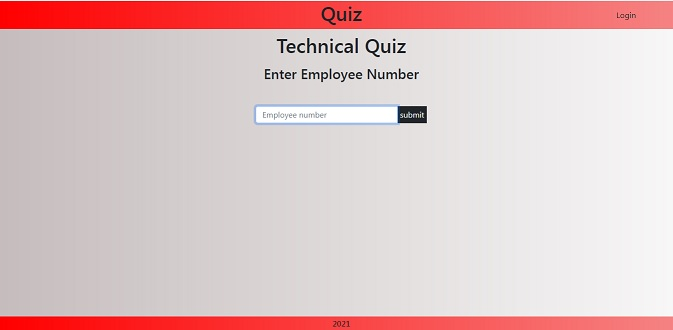
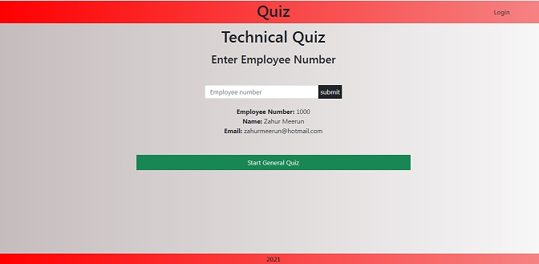
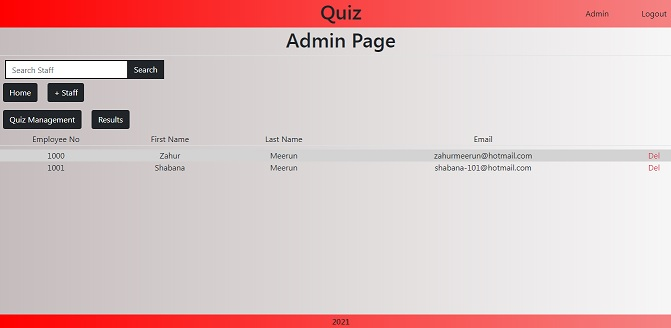
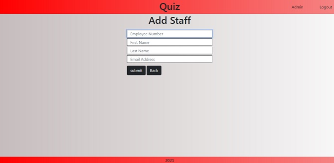
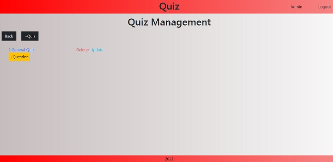
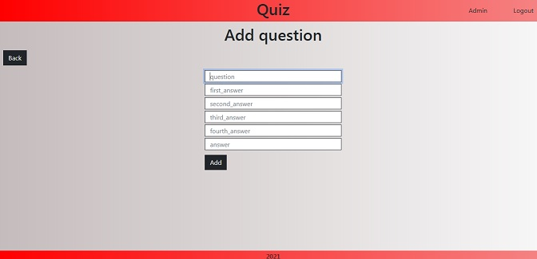
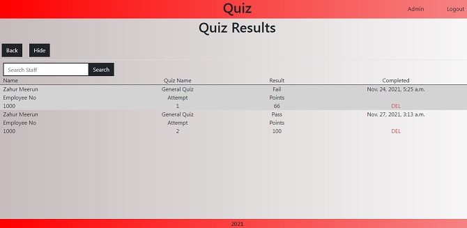

# TABLE OF CONTENT 
* [Summary](#summary)
* [Installation](#installation)
* [Main Features](#main-features)
* [Contact](#contact)

# Summary

Application to allow quiz to be integrated into workspace using existing employee number. 

Quiz and question database full and easy CRUD operations through admin panel.

Results saved to database and can be viewed from admin panel.

Basic protection used to prevent url manipulation by crypting url including coding preventing answering same question twice.

Can change the pass mark from admin interface.

The live site can be found [here](https://django-quiz-zahur.herokuapp.com/) and give it a try using employee number 1000!

# Installation

* clone repo 
* run ```pip install -r requirements.txt```
* run ```python manage.py makemigrate```
* run ```python manage.py migrate```
* run ```python manage.py createsuperuser```
* run ```python manage.py runserver```

# Main Features

* Employees sign in using Employee number




* Admin Interface




* Quiz Management




* Result page



# Contact

If you require further assiatnce please send me a mail on zahurmeerun@hotmail.com